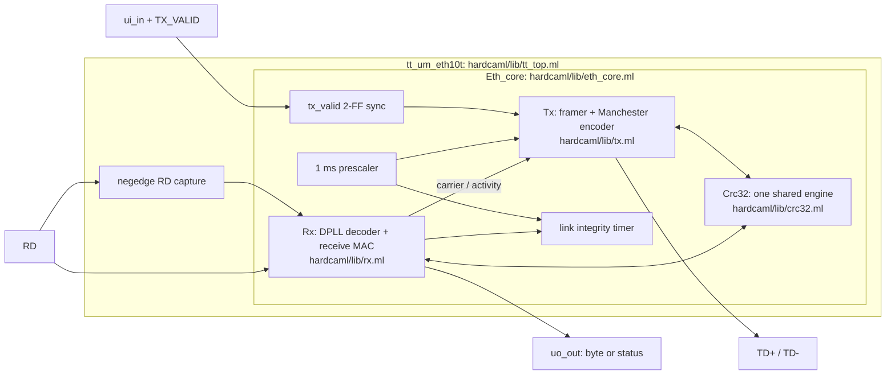
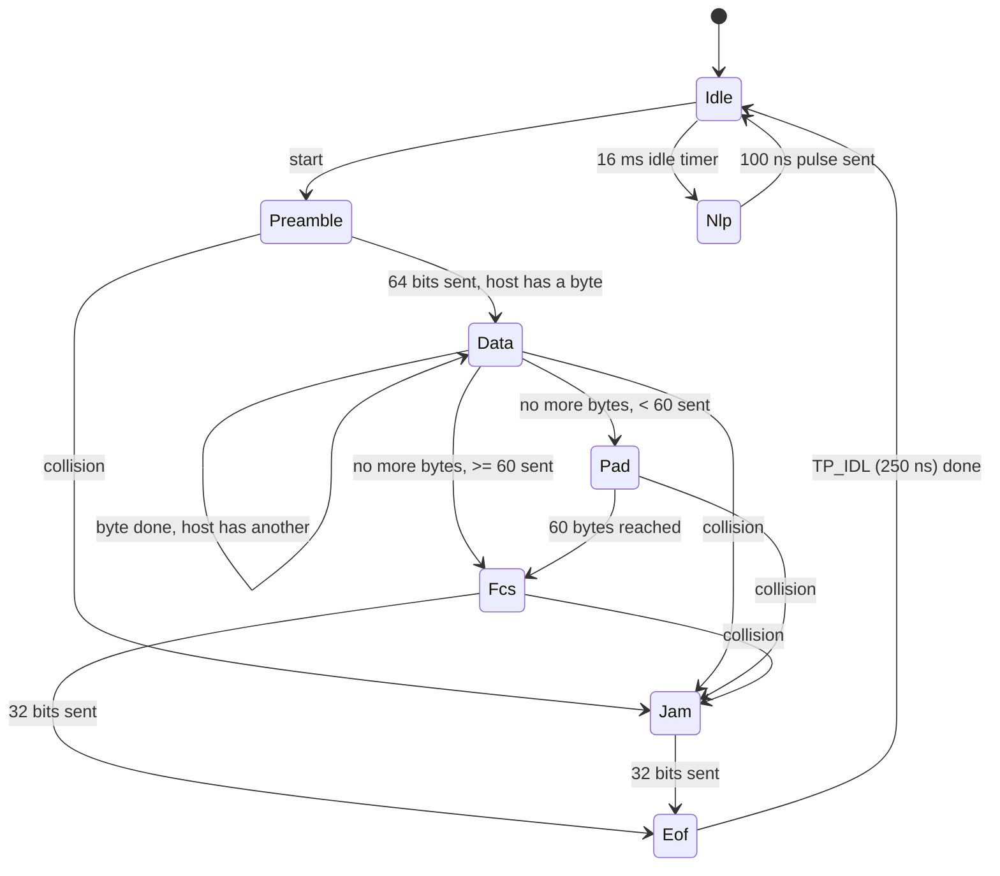

# eth10t: 10BASE-T Ethernet PHY + MAC-lite in Hardcaml

A half-duplex 10 Mb/s Ethernet transceiver written in [Hardcaml](https://github.com/janestreet/hardcaml). It is verified in simulation, with formal proofs and gate-level simulation, and hardened to GDS for a TinyTapeout sky130 1×1 tile (26 pins). FPGA builds exist for the UPduino iCE40UP5K and the Arty A7, but **it has not yet worked on real hardware** (see [§8](#8-fpga-and-asic-results)). It is an entry for the Jane Street Hardcaml chip design competition.

| | |
|---|---|
| Clock | 60 MHz (3 clocks per 50 ns Manchester half-bit) |
| ASIC (sky130, TT 1×1) | 193 flip-flops, 10,401 µm² cells (63 % of the tile), 0.96 mW. DRC/LVS/antenna clean. +4.95 ns setup slack across all 9 corners. |
| iCE40 UP5K | 327 LUT4 + 193 FF (6 % of the device), 60.35 MHz after place and route |
| Receive jitter tolerance | 96/96 frames clean at ±13.5 ns (the 802.3 limit), ±100 ppm clock offset |
| Verification | 23 Hardcaml expect tests, 4 formal properties proven by k-induction, and cocotb on the RTL and gate-level netlist (4/4 each) |
| Real hardware | Not working yet. The Arty build loads and links, but no frames pass. Root cause not found (§8). |

Arty A7 (built-in Ethernet port) and Vivado instructions are in [`fpga/arty/README.md`](fpga/arty/README.md).

---

## Contents
1. [Ethernet deep dive](#1-ethernet-deep-dive)
2. [Architecture](#2-architecture)
3. [How a frame is sent](#3-how-a-frame-is-sent)
4. [How a frame is received](#4-how-a-frame-is-received)
5. [The Verilog](#5-the-verilog)
6. [Pinout and host protocol](#6-pinout-and-host-protocol)
7. [Verification](#7-verification)
8. [FPGA and ASIC results](#8-fpga-and-asic-results)
9. [Repository layout and commands](#9-repository-layout-and-commands)
10. [Not implemented, and what remains](#10-not-implemented-and-what-remains)

---

## 1. Ethernet deep dive

10BASE-T is the original twisted-pair Ethernet, specified in IEEE 802.3 Clause 14. It is simple enough to implement entirely in digital logic, with a transformer and a comparator as the only analog parts.

### 1.1 The physical layer: Manchester code

Data rate is 10 Mb/s, so one bit lasts 100 ns. Each bit is sent as two 50 ns halves, and **there is always a transition in the middle of the bit**:

- `1`: first half low, second half high (a rising edge at mid-bit)
- `0`: first half high, second half low (a falling edge at mid-bit)

```
bits:      1       0       1       1       0
         ___     ___    ___     ___  ___
TD+  ___|   |___|   |__|   |___|   ||   |___
        |<----->|
         100 ns
             ^ mid-bit edge carries the data
```

Because every bit has an edge, the receiver can recover the transmitter's clock from the data itself. The price is 20 MBd signalling for 10 Mb/s of data. There may or may not be an extra edge at a bit boundary; the receiver has to ignore those.

The line is driven differentially on one twisted pair (TD+/TD-) and received on another pair (RD+/RD-), each through a 1:1 isolation transformer. Idle means no differential voltage.

### 1.2 Framing

```
| preamble 7×0x55 | SFD 0xD5 | dest 6 | src 6 | type 2 | payload 46..1500 | FCS 4 | TP_IDL |
```

- **Preamble** is `10101010…` on the wire. Bytes go LSB first, so 0x55 appears as 1,0,1,0,…. It gives the receiver time to lock on.
- **SFD (start frame delimiter)** is 0xD5, which appears as `10101011`. The first `11` marks the start of data.
- **Minimum frame** is 64 bytes including the FCS, so the data (header + payload) is zero-padded to 60 bytes.
- **FCS** is CRC-32 (polynomial 0x04C11DB7, processed bit-reflected as 0xEDB88320), initialised to all ones, transmitted inverted and LSB first. A receiver that runs the same CRC over data and FCS always ends at the constant residue 0xDEBB20E3. That is how `crc_ok` is computed without knowing where the frame ends.
- **TP_IDL** ends a frame: the line is held high for at least 250 ns, then goes idle.

### 1.3 Link integrity

With no traffic, a station sends a **normal link pulse (NLP)** every 16 ± 8 ms. An NLP is a single 100 ns positive pulse. A receiver that sees no pulses and no frames for 50–150 ms declares the link down. Modern NICs send fast link pulse bursts for auto-negotiation, but they fall back to "10 Mb/s half duplex" when they see NLPs. That fallback is called parallel detection, and it is how this design links with a PC.

### 1.4 Sharing the medium: CSMA/CD (half duplex)

- **Carrier sense / deference:** do not start while the line is busy, and wait 96 bit times (9.6 µs, the inter-packet gap) after it goes quiet.
- **Collision detect:** if a signal arrives on RD while transmitting, both stations are talking. Send a 32-bit jam pattern and stop.
- **Backoff:** retry after a random number of 51.2 µs slots (truncated binary exponential). This is the host's job here, and the testbench host implements it.
- **Jabber:** a transmitter stuck on for more than 20–150 ms must be cut off.

### 1.5 Jitter

802.3 lets each edge arrive up to ±13.5 ns from its ideal time at the receiver, because of cable effects and transmitter jitter. A naive receiver that re-syncs on every edge sees up to 27 ns error between consecutive edges. A receiver that averages its phase over many edges only has to absorb 13.5 ns. §4 explains how this design does that.

---

## 2. Architecture



| File | Role |
|---|---|
| `hardcaml/lib/config.ml` | All timing constants in clock cycles: 60 MHz, IPG, TP_IDL, NLP and link timers |
| `hardcaml/lib/crc32.ml` | Bit-serial CRC-32 (`step`), with the polynomial and residue constants |
| `hardcaml/lib/tx.ml` | Transmit FSM, Manchester encoder, NLP, deference, collision/jam, jabber |
| `hardcaml/lib/rx.ml` | DDR-sampled digital PLL decoder, SFD detection, byte assembly, CRC check |
| `hardcaml/lib/eth_core.ml` | Wires TX, RX and the shared CRC together; prescaler, link timer, status byte |
| `hardcaml/lib/tt_top.ml` | TinyTapeout pin mapping and the one falling-edge flop; also a test variant |
| `hardcaml/lib/demo.ml` | FPGA-only host that sends a frame every ~1.1 s and drives LEDs |
| `hardcaml/lib/mii_bridge.ml`, `mdio.ml`, `arty_mii.ml` | Arty only: bridge between our line signals and the board's DP83848 PHY (MII), plus its MDIO setup |
| `hardcaml/bin/gen.ml` | Writes the Verilog |

**Why one CRC engine?** 10BASE-T half duplex never sends and receives a valid frame at the same time. TX owns the CRC while it is busy, and RX owns it otherwise (`eth_core.ml`, `crc_out`). That saves 32 flip-flops and their XOR logic.

---

## 3. How a frame is sent

### 3.1 Host side (pins)

1. The host puts byte 0 on `ui_in` and raises `TX_VALID` (`uio[3]`).
2. Each **rising edge of `TX_READY`** (`uio[4]`) means the byte on `ui_in` was taken. The host puts the next byte there.
3. After the last byte's `TX_READY`, the host drops `TX_VALID` within 800 ns (one byte time). The chip pads and adds the FCS itself.
4. `TX_VALID` stays low for at least 4 clocks between frames.

### 3.2 Inside `hardcaml/lib/tx.ml`

**Synchronise.** `TX_VALID` goes through a 2-flip-flop synchroniser in `eth_core.ml` (`pipeline nr ~n:2 i.tx_valid`).

**Start condition.** `start = tx_valid & armed & ipg_done & ~rx_active` (line ~80).
- `armed` is set whenever `tx_valid` is low and cleared when a frame starts. A host that never releases `TX_VALID` (after a jabber or collision) therefore cannot retransmit forever.
- `ipg_done` means 576 cycles (9.6 µs) have passed since our last frame or since the line went quiet (deference).

**The state machine** (`module State`):



**Bit timing.** A 3-bit `phase` counter counts 0..5 (6 cycles = 100 ns). `bitcnt` counts bits within the current state.

**Which bit to send** (`bit_out`, line ~95):

| State | Bit |
|---|---|
| Preamble | `~bitcnt[0] \| (bitcnt == 63)`, giving 1010…1011: seven 0x55 bytes and the SFD 0xD5 |
| Data | `shreg[0]`, the host byte in a shift register, LSB first |
| Pad | 0 |
| Fcs | `~crc[0]`; the CRC register is shifted right once per bit |
| Jam | alternating 1/0 |

**Manchester encoding** (line ~104):

```ocaml
let first_half = phase.value <:. cfg.half_bit in
let line = mux2 first_half ~:bit_out bit_out in   (* complement, then the bit *)
let td_p = reg nr (mux2 serial line (sm.is Nlp |: sm.is Eof)) in
let td_n = reg nr (serial &: ~:line) in
```

| State | TD+ | TD- |
|---|---|---|
| Sending bits | the Manchester waveform | its complement |
| NLP and TP_IDL | 1 | 0 |
| Idle | 0 | 0 |

TD+ and TD- come straight from flip-flops, so the outputs are glitch-free with minimal skew.

**CRC.** In Data and Pad, each bit goes into the shared CRC. In Fcs, the CRC register is shifted out. `crc_enable` is issued at `phase == 4`, one cycle before the bit ends, because the shared CRC registers its control inputs (for timing, see §8).

**Planned transitions.** To meet 60 MHz on the iCE40, every bit-boundary decision (load next byte, pad, go to FCS, go to Eof, jam, jabber) is computed one cycle early, at `pre_end`. It is stored in registered one-hot "plan" flags (`p_load`, `p_pad`, `p_fcs`, …, line ~113). At `bit_end` the FSM just applies them.

**NLP, collision, jabber.**
- A 5-bit `timer` counts ~1.09 ms ticks from the prescaler.
- In Idle, reaching 15 ticks (16.4 ms) sends an NLP.
- While transmitting, `p_jam` (carrier seen during our frame) switches to Jam at the next bit boundary.
- Reaching 31 ticks (~34 ms) forces Eof and sets `jabber`.

---

## 4. How a frame is received

### 4.1 Double-edge sampling (`tt_top.ml`, `capture_rd_fall`)

RD is sampled on the **falling** clock edge as well as the rising edge. That gives two samples per 16.7 ns clock, so 12 slots of 8.3 ns per bit. The falling-edge flop is the only one in the design, and it sits in the TT wrapper. Hardcaml's cycle simulator has no falling edges, so the testbench variant (`create_rd_fall`) takes that sample as an input. The testbench feeds it the line value from half a clock earlier.

### 4.2 Digital PLL decoder (`rx.ml`, first `compile` block)

```
slot:  0  1  2  3  4  5  6  7  8  9 10 11 | 0 ...
       ^ expected mid-bit edge
       [--window--]           [--window--]      mid-bit window: slots 10..2 (±16.7 ns)
             ^ sample point (slot 3 = 25 ns after mid-bit)
                         ^^ corrections applied here (bit boundary, slots 6..7)
```

1. **Synchronise and find edges.** Both samples pass through 2-FF synchronisers (`s0` = fall, `s1` = rise). `e0 = prev ^ s0` and `e1 = s0 ^ s1` are edges in the first and second half-cycle slot.
2. **Phase reference.** `ph` is a 12-bit one-hot ring: the current slot relative to the expected mid-bit edge. It advances two slots per clock by rotation (`rotl ph 2`). One-hot makes every "is it slot k?" test a single bit.
3. **Acquire.** On an idle line, the first edge starts a session and sets `ph` so that edge is slot 0.
4. **Track (loop filter).** An edge in the mid-bit window votes early or late (`early_vote`, `late_vote`) into a counter `vote`.
   - Once the votes reach a threshold (1 during the first 7 bits for fast lock, then 16), the ring rotates by one extra or one fewer slot at the next bit boundary (`advance`/`retard`, `step`).
   - The reference therefore follows the *average* edge position, not each jittery edge.
   - Edges near the bit boundary are outside the window and are ignored.
5. **Decide the bit.** The data *is* the direction of the mid-bit edge, so the bit is the line level just after that edge (`mid_level`). If no edge was classified, the fallback is the line at slot 3.
   - The sample is registered in one cycle (`sample`), and the decision is made the next (`decide`), again for timing.
6. **End of frame.** A bit with no mid-bit edge is still decoded, which covers one ambiguous edge. A second miss in a row ends the session and drops that trailing sample. So bits come out one bit late through `pending`, and TP_IDL never produces a false bit.
7. **Carrier.** A session that has produced at least 4 bits is carrier. That drives collision detection and deference. An NLP gives only 1–2 bits, so it never looks like a frame.

### 4.3 Receive MAC (`rx.ml`, second `compile` block)

- **SFD.** `sfd = bit_valid & ~in_frame & nbits >= 4 & last_bit & bit`: the first `11` after at least 4 preamble bits. It starts the frame and initialises the CRC.
- **Byte assembly.** Bits shift into `shreg`, LSB first. Every 8th bit copies the byte to `rx_byte` and sets `have_byte`.
- **`RX_VALID`** is `in_frame & have_byte & ~bitidx[2]`. It is high for the first half of each byte time, so each rising edge means a new byte on `uo_out`.
- **CRC.** After every byte, `crc_ok <- (crc == 0xDEBB20E3)` (two cycles later, because the CRC controls are registered). Checking per byte means the last check is the whole frame. Dribble bits after the last full byte are ignored and flagged in `align_err`.
- **End.** When the session ends, `in_frame` drops (`RX_FRAME` falls), `align_err` is updated and `frame_toggle` flips. `uo_out` then shows the status byte, which includes `CRC_OK`.

### 4.4 Link integrity (`eth_core.ml`, `link_up`)

Every session end (an NLP or a frame) sets `link_up` and clears a 6-bit counter of ~1.09 ms ticks. After 63 ticks (~69 ms) of silence, `link_up` drops. The spec asks for 50–150 ms.

---

## 5. The Verilog

All Verilog is **generated from Hardcaml** by `hardcaml/bin/gen.ml` (`make verilog`). Nothing is hand-written except the small FPGA board wrappers.

| File | What it is |
|---|---|
| `src/tt_um_eth10t.v` | **The chip.** Flat module with the exact TinyTapeout ports: `clk, rst_n, ena, ui_in[7:0], uio_in[7:0], uo_out[7:0], uio_out[7:0], uio_oe[7:0]`. Committed, because TT's CI reads it. |
| `gen/tt_um_eth10t_rd_fall.v` | Same logic with the falling-edge RD sample as an input plus an `invariant` output. Used by the formal proof. |
| `gen/eth10t_demo.v` | The chip plus the demo host (frame ROM, LED stretchers). Used by the UPduino build. |
| `gen/eth10t_arty.v` | Demo host + chip + MII bridge + MDIO setup. Used by the Arty build. |
| `fpga/upduino/top.v`, `fpga/arty/top.v` | Hand-written board wrappers: PLL/MMCM to 60 MHz, power-on reset, LED drivers |

**Reading the generated Verilog.**
- Key registers keep their Hardcaml names: `tx_state`, `tx_phase`, `tx_bitcnt`, `tx_bytecnt`, `tx_timer`, `rx_ph`, `rx_active`, `rx_seen`, `rx_vote`, `rx_nbits`, `rx_in_frame`, `rx_bitidx`. Everything else is `_NNN` wires.
- The one `always @(negedge clk)` block is the RD capture.
- Resets are synchronous (`if (clear)` inside `always @(posedge clk)`), with `clear = ~rst_n`.
- Registers that are pure functions of other registers (plans, registered compares, synchronisers) have no reset. They settle while `rst_n` is held low, which is why reset must last at least 4 clocks. Gate-level simulation confirms it.

The `TX` state encoding is binary (3 bits). `rx_ph` is 12-bit one-hot.

---

## 6. Pinout and host protocol

| Pin | Dir | Function |
|---|---|---|
| `ui_in[7:0]` | in | TX byte |
| `uo_out[7:0]` | out | RX byte while `RX_FRAME` = 1, otherwise the status byte |
| `uio[0]` | out | TD+ |
| `uio[1]` | out | TD- |
| `uio[2]` | in | RD (comparator output: 1 = positive differential) |
| `uio[3]` | in | TX_VALID |
| `uio[4]` | out | TX_READY (rising edge = byte taken) |
| `uio[5]` | out | RX_VALID (rising edge = new byte on `uo_out`) |
| `uio[6]` | out | RX_FRAME (high during a received frame) |
| `uio[7]` | out | LINK_UP |

`uio_oe` is fixed at `0xF3`.

Status byte (on `uo_out` when `RX_FRAME` = 0), from `Eth_core.Status`:

| bit | 7 | 6 | 5 | 4 | 3 | 2 | 1 | 0 |
|---|---|---|---|---|---|---|---|---|
| | LINK_UP | FRAME_TOGGLE | ALIGN_ERR | CRC_OK | JABBER | COLLISION | CARRIER | TX_BUSY |

`FRAME_TOGGLE` flips once per received frame, so a host polling the status byte can tell a new frame arrived. The received bytes include the 4 FCS bytes at the end.

---

## 7. Verification

| Layer | Where | What |
|---|---|---|
| Unit | `hardcaml/test/test_crc.ml` | CRC check value 0xCBF43926, residue, 200 random vectors against a software CRC |
| TX compliance | `hardcaml/test/test_tx.ml` | Cycle-exact waveform, bit for bit against `reference.ml`; TP_IDL; NLP width and period; jabber |
| System | `hardcaml/test/test_system.ml` | Two chips on a cable: CRC corruption, lost preamble, collision/jam, deference, link up/down |
| Constrained random | `hardcaml/test/test_random.ml` | Random lengths, clock offset, jitter and traffic in both directions (echo, contention, backoff). Scoreboard against the reference model, coverage-driven until all bins are hit. |
| Jitter | `hardcaml/test/test_jitter.ml` | Receive success vs. random edge jitter, over 3 clock offsets × 4 phases |
| Formal | `formal/props.sv`, `formal/run.ys` | k-induction (yosys SAT) over every reachable state |
| Tile / gate level | `test/` (cocotb + Icarus) | Two TT tiles cross-wired. Runs on the RTL and on the post-layout netlist, like TinyTapeout CI. |
| Arty MII bridge | `hardcaml/test/test_mii.ml` | Bridge TX/RX against a PHY pin model (±100 ppm), chip-to-chip over MII, MDIO bit stream, whole board logic |

**The simulation harness** (`hardcaml/test/harness.ml`) models:
- two nodes with **independent clocks** in continuous time (femtoseconds), with a clock offset in ppm and a random phase;
- a **cable** with delay, random per-edge jitter, glitch injection and cut;
- a **host** that follows the pin protocol, including binary exponential backoff.

Every cycle it also checks the design's internal `invariant` output.

**Formal properties**, proven for all time, not bounded:
1. TD+ and TD- are never both driven. `uio_oe` never changes. `RX_VALID` only happens inside a frame.
2. A byte is only taken if `TX_VALID` was high as it came through the synchroniser.
3. **No pulse shorter than a Manchester half-bit (50 ns) ever reaches the line.**
4. Internal counters stay in their legal ranges. This is the `invariant`, needed for property 3 to be inductive.

**Results**
```
TX waveform           bits match reference, TP_IDL 250 ns, NLP 100 ns every 16.38 ms
Jabber                cut off after 33.9 ms
Collision             both sides jam and report it; no good frame delivered
Deference             waits 9.9 µs after carrier (≥ 9.6 µs)
Link                  up at first NLP (16.4 ms); down 69.5 ms after cable cut
Random                36 scenarios, 152 frames, 0 mismatches, all 16 coverage bins hit
                      (incl. 13 collision + backoff recoveries)
Jitter (good/96)      0 ns 96 | 5 ns 96 | 10 ns 96 | 12 ns 96 | 13.5 ns 96 | 15 ns 89 | 17.5 ns 33
cocotb                RTL 4/4, gate-level netlist 4/4
```

**Bugs found by this verification:**
- The pad byte counter wrapped at 64, so frames over 64 bytes were padded wrongly.
- A jabber cut could emit a short pulse (found by formal).
- The DPLL could apply a phase correction twice.
- Two host-model bugs in the testbench itself.

---

## 8. FPGA and ASIC results

### TinyTapeout / sky130 (OpenLane 2.3.10, `make harden`)
| Metric | Value |
|---|---|
| Die | TT 1×1 tile, 161 × 111.52 µm |
| Cells | 1,191 (193 sequential, 539 logic, 165 timing-repair buffers, 119 hold buffers) |
| Std-cell area | 10,401 µm², 63 % utilisation |
| Setup slack at 60 MHz | +4.95 ns worst corner, so ~85 MHz possible |
| Hold slack | +0.10 ns, 0 violations |
| DRC / LVS / antenna | 0 / 0 / 0 |
| Power | 0.96 mW |

### UPduino v3 (iCE40UP5K, `make fpga`)
The bitstream builds; **it has not been tested on the board.** It needs an RJ45 jack and a comparator wired to pins 2–4.

60.35 MHz. The PLL makes exactly 60.000 MHz from the 12 MHz oscillator. The UP5K is a slow fabric (~3 ns per logic level), so meeting 60 MHz needed several changes:
- a one-hot DPLL phase;
- planned TX transitions;
- registered CRC controls, votes and compares;
- a two-stage demo ROM;
- `synth_ice40 -device u`.

These raised the LUT count from 237 to 327. The margin is small and depends on the placement seed (`tools/seeds.sh`).

Board pins (`fpga/upduino/upduino.pcf`): 12 MHz clock on pin 35 (close the OSC jumper), TD+ on 2, TD- on 3, RD on 4, and the RGB LED (red = no link, green = link, blue = activity).

### Arty A7: built-in Ethernet port (stopped, not working)

The Arty's RJ45 jack isn't wired to the FPGA; it's wired to a TI DP83848 PHY chip. An FPGA-only bridge (`hardcaml/lib/mii_bridge.ml`) translates between our chip's Manchester line signals and the PHY's MII bus. An MDIO block (`mdio.ml`) configures the PHY for 10 Mb/s. Details: [`fpga/arty/README.md`](fpga/arty/README.md).

**What works on the board**
- Vivado builds and meets timing (WNS +7 ns at 60 MHz), and the bitstream loads (RAM only, nothing permanent).
- The PHY runs from our 25 MHz clock and links with the PC.
- Our design runs and sends a frame every ~1.1 s (LD4 blinks), and reports that it sent its MDIO writes (LD6 on).

**What doesn't**
1. **The 10 Mb/s setting doesn't stick.** With Windows on auto, the link comes up at **100 Mb/s**, which our design can't use. Worked around by setting the PC's adapter to "10 Mbps Half Duplex".
2. **Transmit:** at 10 Mb/s, Wireshark and `pktmon` see **none** of our frames. The adapter's counters show **0** broadcast packets and **0** errors.
3. **Receive:** the PC does send its own frames on the link, but LD5 (good frame received) never lights.

**What was tried**
| Fix | Result |
|---|---|
| Renamed a Verilog instance called `design`, a reserved word Vivado rejects | Build works |
| **Echo filter.** In 10 Mb/s half duplex the PHY echoes our transmission back to us (802.3 loopback). Our chip took that as a collision and aborted each frame after 15 nibbles. The bridge now drops frames that start while we transmit. | Reproduced and fixed in simulation; hardware unchanged |
| Sample RXD just *before* the RX_CLK edge (MII-safe) instead of after | Hardware unchanged |
| **Check views.** Added LED views, selected by SW0/SW1, showing MII clocks, TX_EN, RX_DV, and an MDIO readback of the PHY's ID and registers | Built and tested in simulation; **not yet read on the board** |

**What's stopping it.** Every direction of FPGA→PHY communication fails in the same way: the MDIO writes, the transmit data, and the receive path. Meanwhile the PHY itself works (it links). That pattern points at the interface between the FPGA and the PHY rather than at the Ethernet logic, which passes all its simulations. It is most likely one of:
- a pin or bank mismatch;
- the PHY's actual mode or address differing from what we assumed (MII, address 1);
- a behaviour of the real DP83848 that the simulation model doesn't have.

It's unresolved because each attempt was a guess without seeing the real signals. The check views were built to end the guessing, but they haven't been read yet.

**Next step if resumed (about 2 minutes).** With the current bitstream loaded, note LD4–LD7 with SW0 up, then with SW1 up (see the table in `fpga/arty/README.md`).
- The MII view shows whether the PHY's clocks reach us and whether TX_EN leaves.
- The MDIO view shows whether the PHY answers at all (LD7) and whether it's a DP83848 at address 1 (LD4).

This is an FPGA-only path. It doesn't affect the ASIC, whose logic is verified independently.

---

## Project log

What was done, in order:
1. **Design.** Hardcaml RTL for a 10BASE-T PHY + MAC-lite at 60 MHz: Manchester TX, link pulses, CSMA/CD with jam, jabber, shared CRC, TinyTapeout pin map.
2. **Simulation.** A two-node testbench with independent clocks and a jittery cable. Found and fixed a pad-counter overflow (frames over 64 bytes).
3. **Receiver upgrade.** Double-edge RD sampling, a loop-filtered DPLL and edge-direction decoding: from ±5 ns to the full ±13.5 ns jitter spec.
4. **Formal.** Four safety properties proven by k-induction with yosys. Found and fixed a short-pulse bug in the jabber cut-off.
5. **Constrained-random testing** with a scoreboard and coverage closure, including collisions and backoff.
6. **UPduino timing closure** to 60 MHz: one-hot phase, planned FSM transitions, registered controls, and the `-device u` timing model.
7. **TinyTapeout GDS** with OpenLane 2: clean DRC/LVS/antenna and +4.95 ns slack. A cocotb testbench passes on the RTL and the gate-level netlist.
8. **GDS viewing.** KLayout render and viewer script (`make view`, `make gds-png`).
9. **Arty, first version (Pmod + external jack).** Replaced, because you wanted the built-in port.
10. **Arty, built-in port.** MII bridge + MDIO. Hardware debugging as described above; stopped with the cause unresolved.

## 9. Repository layout and commands

```
hardcaml/lib/     design (Hardcaml)            hardcaml/test/  simulation tests
hardcaml/bin/     Verilog generator            formal/         formal properties
src/              TT: generated tile + config  test/           TT cocotb tests
info.yaml, docs/  TT project info/datasheet    fpga/           board wrappers
tools/            harden, timing helpers       tt/, runs/, gen/  (generated, git-ignored)
```

| Command | Does |
|---|---|
| `make test` | Hardcaml test suite (~1 min) |
| `make verilog` | Regenerate `src/tt_um_eth10t.v` and `gen/*.v` |
| `make lint` | Verilator lint |
| `make formal` | Prove the properties |
| `make stat` | LUT / cell counts |
| `make fpga`, `make prog` | UPduino bitstream, flash |
| `make arty` | Copy the Arty build to `D:\JaneStreet_Chip\eth10t` |
| `make cocotb`, `make gl` | TT tests on the RTL / gate-level netlist |
| `make harden` | GDS via OpenLane 2 in Docker (~2.5 min) into `runs/wokwi/final/gds/` |

Requirements: OCaml 5 with `hardcaml`, `ppx_hardcaml`, `hardcaml_waveterm`, `core`, `ppx_jane`; yosys; nextpnr-ice40 and icestorm; verilator; iverilog; cocotb 2.1; OpenLane 2 with Docker and the sky130 PDK.

---

## 10. Not implemented, and what remains

**Not implemented:**
- auto-negotiation fast link pulses (we rely on parallel detection);
- automatic polarity correction;
- full duplex;
- runt and oversize frame filtering;
- address filtering;
- backoff in hardware (the host does it).

The analog parts are off-chip: a transformer/RJ45 jack and a receive comparator.

**Remaining:**
- Arty: read the check views and fix the FPGA↔PHY link (see §8), or drop the Arty path;
- UPduino / TinyTapeout chip: hardware bring-up with an RJ45 jack and a receive comparator;
- your GitHub username in `top_module` and your name in `info.yaml`;
- pushing to GitHub so TinyTapeout CI runs;
- optional: reducing hold/repair buffers (~27 % of cells) and adding UPduino timing margin.
