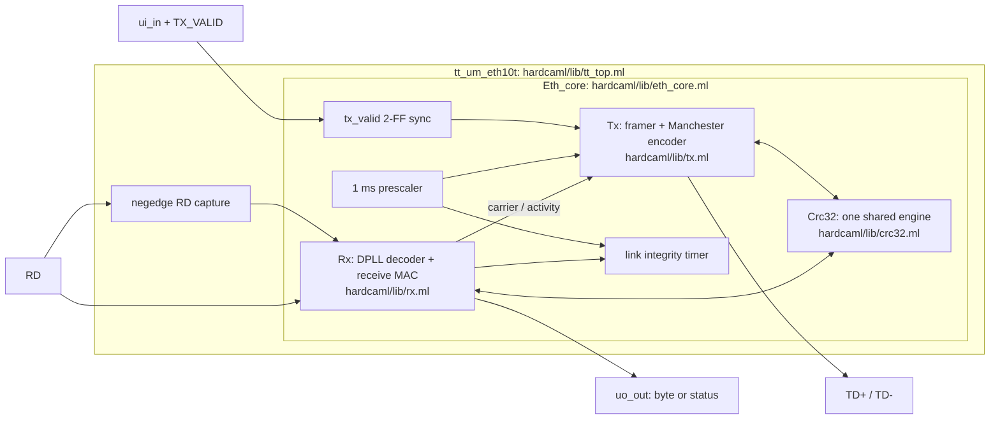
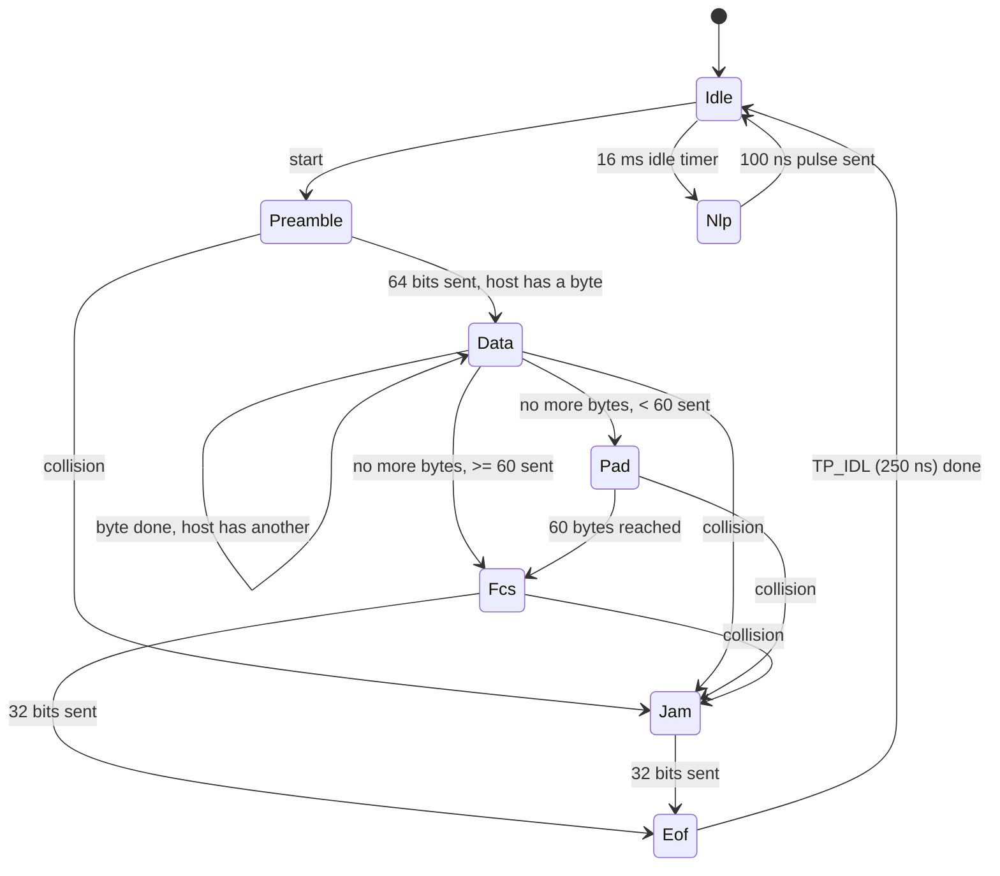

# eth10t: 10BASE-T Ethernet in Hardcaml, from RTL to GDS and real hardware

A 10 Mb/s Ethernet design written in [Hardcaml](https://github.com/janestreet/hardcaml), for the Jane Street Hardcaml chip design competition. It has two deliverables:

1. **The chip:** `tt_um_eth10t`. A complete half-duplex 10BASE-T PHY + MAC-lite: Manchester encoder, a digital-PLL receiver that tolerates the full 802.3 jitter spec, link pulses, CSMA/CD, and CRC-32. It is verified in simulation, with formal proofs and gate-level simulation, and hardened to a clean GDS for a TinyTapeout sky130 1×1 tile (26 pins).
2. **The FPGA demo:** an Arty A7 build that sends and receives real Ethernet frames through the board's own RJ45 port. **It works on hardware:** a Windows PC captures our frames in Wireshark (`Hello from Hardcaml 10BASE-T #n`), and the FPGA receives the PC's frames with correct CRCs.

---

## Status at a glance

Each claim below comes with how it was checked, so nothing has to be taken on trust.

| What | Status | Evidence |
|---|---|---|
| Chip RTL (Hardcaml) | Done | `hardcaml/lib/` |
| Chip simulation | Pass | 16 Hardcaml expect tests (`make test`), including constrained-random tests with coverage closure and a jitter sweep (§7) |
| Chip formal | Proven | 4 properties by k-induction, for all reachable states (`make formal`) |
| Chip gate level | Pass | cocotb on the post-layout netlist, 4/4 (`make gl`) |
| Chip GDS (sky130, TT 1×1) | Clean | DRC 0, LVS 0, antenna 0. Setup slack +4.95 ns and hold slack +0.10 ns across all 9 corners at 60 MHz (`make harden`) |
| Chip on real silicon | **Not yet** | Needs fabrication through TinyTapeout, plus an RJ45 jack and comparator on the board |
| **Arty A7, on-board Ethernet** | **Works on hardware** | Wireshark on the PC shows our frames, with correct payload and an incrementing sequence byte; LD5 shows the FPGA receiving the PC's frames; the link is 10 Mbps (§8.3) |
| Arty timing (Vivado 2025.2) | Met | WNS +6.845 ns, WHS +0.128 ns, constrained for 25 MHz MII clocks (the 100 Mb/s worst case) |
| UPduino iCE40 build | Builds, 60.35 MHz | **Not tested on a board.** It needs an external RJ45 jack and comparator. |

**Important: the Arty demo runs different logic from the chip.** The Arty's RJ45 jack is wired to its own PHY chip (TI DP83848), which does the cable-side work (Manchester, link pulses, clock recovery) and gives the FPGA 4-bit words over MII. So the Arty runs an **MII MAC** (`hardcaml/lib/mii_mac.ml`) that shares the CRC-32 module and frame format with the chip. It does not run the chip's Manchester encoder or DPLL. The chip's cable-side logic is proven by simulation, formal proofs and gate-level simulation, not yet on hardware. §8.3 explains why.

| | Chip (`tt_um_eth10t`) | Arty demo (`eth10t_arty`) |
|---|---|---|
| Talks to | The cable directly (via transformer + comparator) | The DP83848 PHY chip over MII |
| Clock | 60 MHz | 25 MHz system; the PHY's TX_CLK / RX_CLK for the MAC |
| Manchester, DPLL, link pulses | In our logic | Done by the DP83848 |
| Framing, padding, CRC-32 | In our logic | In our logic (same `crc32.ml`) |
| Size | 193 FF, 10,401 µm² (sky130) | 336 LUT, 311 FF (Artix-7) |

---

## Contents
1. [Ethernet deep dive](#1-ethernet-deep-dive)
2. [Chip architecture](#2-chip-architecture)
3. [How the chip sends a frame](#3-how-the-chip-sends-a-frame)
4. [How the chip receives a frame](#4-how-the-chip-receives-a-frame)
5. [The Verilog](#5-the-verilog)
6. [Chip pinout and host protocol](#6-chip-pinout-and-host-protocol)
7. [Verification](#7-verification)
8. [Results: ASIC, UPduino, Arty](#8-results-asic-upduino-arty)
9. [Project log: everything that was done, in order](#9-project-log-everything-that-was-done-in-order)
10. [Repository layout and commands](#10-repository-layout-and-commands)
11. [Limits and what remains](#11-limits-and-what-remains)

---

## 1. Ethernet deep dive

10BASE-T is the original twisted-pair Ethernet, specified in IEEE 802.3 Clause 14. It is simple enough to implement entirely in digital logic, with a transformer and a comparator as the only analog parts.

### 1.1 The physical layer: Manchester code

Data rate is 10 Mb/s, so one bit lasts 100 ns. Each bit is sent as two 50 ns halves, and **there is always a transition in the middle of the bit**:

- `1`: first half low, second half high (a rising edge at mid-bit)
- `0`: first half high, second half low (a falling edge at mid-bit)

```
bits:      1       0       1       1       0
         ___     ___    ___     ___  ___
TD+  ___|   |___|   |__|   |___|   ||   |___
        |<----->|
         100 ns
             ^ mid-bit edge carries the data
```

Because every bit has an edge, the receiver can recover the transmitter's clock from the data itself. The price is 20 MBd signalling for 10 Mb/s of data. There may or may not be an extra edge at a bit boundary, and the receiver has to ignore those.

The line is driven differentially on one twisted pair (TD+/TD-) and received on another (RD+/RD-), each through a 1:1 isolation transformer. Idle means no differential voltage.

### 1.2 Framing

```
| preamble 7×0x55 | SFD 0xD5 | dest 6 | src 6 | type 2 | payload 46..1500 | FCS 4 | TP_IDL |
```

- **Preamble:** `10101010…` on the wire. Bytes go LSB first, so 0x55 appears as 1,0,1,0,…. It gives the receiver time to lock on.
- **SFD** (start frame delimiter): 0xD5, which appears as `10101011`. The final `11` marks the start of data.
- **Minimum frame:** 64 bytes including the FCS, so the data (header + payload) is zero-padded to 60 bytes.
- **FCS:** CRC-32 with polynomial 0x04C11DB7, processed bit-reflected as 0xEDB88320. It is initialised to all ones and transmitted inverted, LSB first. A receiver that runs the same CRC over data *and* FCS always ends at the constant **residue 0xDEBB20E3**. That is how both of our receivers check a frame without knowing in advance where it ends.
- **TP_IDL:** ends a 10BASE-T frame by holding the line high for at least 250 ns, then going idle.

### 1.3 Link integrity

With no traffic, a station sends a **normal link pulse (NLP)** every 16 ± 8 ms: a single 100 ns positive pulse. A receiver that sees no pulses or frames for 50–150 ms declares the link down.

Modern NICs send fast-link-pulse bursts to auto-negotiate. They fall back to "10 Mb/s half duplex" when they only see NLPs. This fallback is called parallel detection, and it is how the chip links with a PC.

### 1.4 Sharing the medium: CSMA/CD (half duplex)

- **Carrier sense / deference:** do not start while the line is busy, and wait 96 bit times (9.6 µs, the inter-packet gap) after it goes quiet.
- **Collision detect:** a signal arriving on RD while we transmit means two stations are talking. Send a 32-bit jam pattern and stop.
- **Backoff:** retry after a random number of 51.2 µs slots (truncated binary exponential). This is the host's job here; the testbench host implements it.
- **Jabber:** a transmitter stuck on for more than 20–150 ms must be cut off.

### 1.5 Jitter

802.3 lets each edge arrive up to ±13.5 ns from its ideal time at the receiver. A naive receiver that re-syncs on every edge sees up to 27 ns of error between consecutive edges. One that averages its phase over many edges only has to absorb 13.5 ns. §4 shows how the chip does that.

### 1.6 When a PHY chip does the line work: MII (the Arty)

Most boards, including the Arty, put a separate **PHY chip** between the FPGA and the jack. The FPGA then only needs a **MAC**, and it talks to the PHY over **MII**:

| Signal | Direction | Meaning |
|---|---|---|
| `TX_CLK` | PHY → FPGA | 2.5 MHz at 10 Mb/s, 25 MHz at 100 Mb/s |
| `TXD[3:0]`, `TX_EN` | FPGA → PHY | One nibble (4 bits) per `TX_CLK`; `TXD[0]` goes on the wire first. The MAC sends the preamble and SFD as nibbles too: fifteen `0x5`, then `0xD`. |
| `RX_CLK`, `RXD[3:0]`, `RX_DV` | PHY → FPGA | Received nibbles, valid at the rising edge of `RX_CLK` |
| `CRS` | PHY → FPGA | Carrier: someone is talking on the cable |
| `MDC`, `MDIO` | both | Slow management bus for reading and writing the PHY's registers |

**The rule that matters:** `TX_CLK` and `RX_CLK` *are the clocks* for the MAC logic. §8.3 describes what happened when the first Arty version broke this rule.

---

## 2. Chip architecture



| File | Role |
|---|---|
| `hardcaml/lib/config.ml` | All timing constants in clock cycles: 60 MHz, IPG, TP_IDL, NLP and link timers |
| `hardcaml/lib/crc32.ml` | Bit-serial CRC-32 (`step`), with the polynomial and residue constants. Shared with the Arty MAC. |
| `hardcaml/lib/tx.ml` | Transmit FSM, Manchester encoder, NLP, deference, collision/jam, jabber |
| `hardcaml/lib/rx.ml` | DDR-sampled digital PLL decoder, SFD detection, byte assembly, CRC check |
| `hardcaml/lib/eth_core.ml` | Wires TX, RX and the shared CRC together; prescaler, link timer, status byte |
| `hardcaml/lib/tt_top.ml` | TinyTapeout pin mapping and the one falling-edge flop; also a test variant |
| `hardcaml/lib/demo.ml` | FPGA host for the UPduino: sends a frame every ~1.1 s and drives LEDs. Its frame bytes are reused by the Arty. |
| `hardcaml/lib/mii_mac.ml` | **Arty:** MII MAC. TX on `TX_CLK`, RX on `RX_CLK` |
| `hardcaml/lib/mdio.ml` | **Arty:** MDIO master. Configures the PHY and reads its status. |
| `hardcaml/lib/arty_mii.ml` | **Arty:** board logic (PHY reset, frame timer, clock-domain crossings, LEDs) |
| `hardcaml/bin/gen.ml` | Writes all the Verilog |

**Why one CRC engine?** In 10BASE-T half duplex we never send and receive a valid frame at the same time. TX owns the CRC while it is busy and RX owns it otherwise (`eth_core.ml`, `crc_out`). That saves 32 flip-flops and their XOR logic.

---

## 3. How the chip sends a frame

### 3.1 Host side (pins)

1. The host puts byte 0 on `ui_in` and raises `TX_VALID` (`uio[3]`).
2. Each **rising edge of `TX_READY`** (`uio[4]`) means the byte on `ui_in` was taken. The host puts the next byte there.
3. After the last byte's `TX_READY`, the host drops `TX_VALID` within 800 ns (one byte time). The chip pads the frame and adds the FCS itself.
4. `TX_VALID` stays low for at least 4 clocks between frames.

### 3.2 Inside `hardcaml/lib/tx.ml`

**Synchronise.** `TX_VALID` goes through a 2-flip-flop synchroniser in `eth_core.ml` (`pipeline nr ~n:2 i.tx_valid`).

**Start condition.** `start = tx_valid & armed & ipg_done & ~rx_active`.
- `armed` is set whenever `tx_valid` is low and cleared when a frame starts. A host that never releases `TX_VALID` (after a jabber or collision) therefore can't retransmit forever.
- `ipg_done` means 576 cycles (9.6 µs) have passed since our last frame or since the line went quiet (deference).

**The state machine** (`module State`):



**Bit timing.** A 3-bit `phase` counter counts 0..5 (6 cycles = 100 ns). `bitcnt` counts bits within the current state.

**Which bit to send** (`bit_out`):

| State | Bit |
|---|---|
| Preamble | `~bitcnt[0] \| (bitcnt == 63)`, giving 1010…1011: seven 0x55 bytes and the SFD 0xD5 |
| Data | `shreg[0]`, the host byte in a shift register, LSB first |
| Pad | 0 |
| Fcs | `~crc[0]`; the CRC register is shifted right once per bit |
| Jam | alternating 1/0 |

**Manchester encoding:**

```ocaml
let first_half = phase.value <:. cfg.half_bit in
let line = mux2 first_half ~:bit_out bit_out in   (* complement, then the bit *)
let td_p = reg nr (mux2 serial line (sm.is Nlp |: sm.is Eof)) in
let td_n = reg nr (serial &: ~:line) in
```

| State | TD+ | TD- |
|---|---|---|
| Sending bits | the Manchester waveform | its complement |
| NLP and TP_IDL | 1 | 0 |
| Idle | 0 | 0 |

TD+ and TD- come straight from flip-flops, so the outputs are glitch-free with minimal skew.

**CRC.** In Data and Pad, each bit goes into the shared CRC. In Fcs, the CRC register is shifted out. `crc_enable` is issued at `phase == 4`, one cycle before the bit ends, because the shared CRC registers its control inputs for timing.

**Planned transitions.** Every bit-boundary decision (load the next byte, pad, go to FCS, go to Eof, jam, jabber) is computed one cycle early, at `pre_end`. It is stored in registered one-hot "plan" flags (`p_load`, `p_pad`, `p_fcs`, …), and at `bit_end` the FSM just applies them. This is what lets the design meet 60 MHz on the slow iCE40.

**NLP, collision, jabber.**
- A 5-bit `timer` counts ~1.09 ms ticks from the prescaler.
- In Idle, reaching 15 ticks (16.4 ms) sends an NLP.
- While transmitting, `p_jam` (carrier seen during our frame) switches to Jam at the next bit boundary.
- Reaching 31 ticks (~34 ms) forces Eof and sets `jabber`.

---

## 4. How the chip receives a frame

### 4.1 Double-edge sampling (`tt_top.ml`, `capture_rd_fall`)

RD is sampled on the **falling** clock edge as well as the rising edge. That gives two samples per 16.7 ns clock: 12 slots of 8.3 ns per bit.

The falling-edge flop is the only one in the design, and it sits in the TT wrapper. Hardcaml's cycle simulator has no falling edges, so the testbench variant (`create_rd_fall`) takes that sample as an input, fed with the line value from half a clock earlier.

### 4.2 Digital PLL decoder (`rx.ml`, first `compile` block)

```
slot:  0  1  2  3  4  5  6  7  8  9 10 11 | 0 ...
       ^ expected mid-bit edge
       [--window--]           [--window--]      mid-bit window: slots 10..2 (±16.7 ns)
             ^ sample point (slot 3 = 25 ns after mid-bit)
                         ^^ corrections applied here (bit boundary, slots 6..7)
```

1. **Synchronise and find edges.** Both samples pass through 2-FF synchronisers (`s0` = fall, `s1` = rise). `e0 = prev ^ s0` and `e1 = s0 ^ s1` are edges in the first and second half-cycle slot.
2. **Phase reference.** `ph` is a 12-bit one-hot ring: the current slot relative to the expected mid-bit edge. It advances two slots per clock by rotation (`rotl ph 2`). One-hot makes every "is it slot k?" test a single bit.
3. **Acquire.** On an idle line, the first edge starts a session and sets `ph` so that edge is slot 0.
4. **Track (loop filter).** An edge in the mid-bit window votes early or late (`early_vote`, `late_vote`) into a counter `vote`.
   - Once the votes reach a threshold (1 during the first 7 bits for fast lock, then 16), the ring rotates by one extra or one fewer slot at the next bit boundary (`advance`/`retard`, `step`).
   - The reference therefore follows the *average* edge position, not each jittery edge.
   - Edges near the bit boundary are outside the window and are ignored.
5. **Decide the bit.** The data *is* the direction of the mid-bit edge, so the bit is the line level just after that edge (`mid_level`). If no edge was classified, the fallback is the line at slot 3. The sample is registered in one cycle (`sample`) and decided the next (`decide`), again for timing.
6. **End of frame.** A bit with no mid-bit edge is still decoded, which tolerates one ambiguous edge. A second miss in a row ends the session and drops that trailing sample. So bits come out one bit late through `pending`, and TP_IDL never produces a false bit.
7. **Carrier.** A session that has produced at least 4 bits counts as carrier, which drives collision detection and deference. An NLP gives only 1–2 bits, so it never looks like a frame.

### 4.3 Receive MAC (`rx.ml`, second `compile` block)

- **SFD:** `sfd = bit_valid & ~in_frame & nbits >= 4 & last_bit & bit`, the first `11` after at least 4 preamble bits. It starts the frame and initialises the CRC.
- **Byte assembly:** bits shift into `shreg`, LSB first. Every 8th bit copies the byte to `rx_byte` and sets `have_byte`.
- **`RX_VALID`** = `in_frame & have_byte & ~bitidx[2]`. It is high for the first half of each byte time, so each rising edge means a new byte on `uo_out`.
- **CRC:** after every byte, `crc_ok <- (crc == 0xDEBB20E3)`, two cycles later because the CRC controls are registered. Checking per byte means the last check covers the whole frame. Dribble bits after the last full byte are ignored and flagged in `align_err`.
- **End:** when the session ends, `in_frame` drops (`RX_FRAME` falls), `align_err` is updated and `frame_toggle` flips. `uo_out` then shows the status byte, including `CRC_OK`.

### 4.4 Link integrity (`eth_core.ml`, `link_up`)

Every session end (an NLP or a frame) sets `link_up` and clears a 6-bit counter of ~1.09 ms ticks. After 63 ticks (~69 ms) of silence, `link_up` drops. The spec asks for 50–150 ms.

---

## 5. The Verilog

All Verilog is **generated from Hardcaml** by `hardcaml/bin/gen.ml` (`make verilog`). The only hand-written Verilog is the two small FPGA board wrappers.

| File | What it is |
|---|---|
| `src/tt_um_eth10t.v` | **The chip.** A flat module with the exact TinyTapeout ports (`clk, rst_n, ena, ui_in, uio_in, uo_out, uio_out, uio_oe`). Committed, because TinyTapeout's CI reads it. |
| `gen/tt_um_eth10t_rd_fall.v` | The same logic, with the falling-edge RD sample as an input and an `invariant` output. Used by the formal proof. |
| `gen/eth10t_demo.v` | The chip plus the demo host. Used by the UPduino build. |
| `gen/eth10t_arty.v` | MII MAC + MDIO + board logic. Used by the Arty build. |
| `fpga/upduino/top.v` | Hand-written: PLL to 60 MHz, power-on reset, RGB LED driver |
| `fpga/arty/top.v` | Hand-written: MMCM to 25 MHz, 25 MHz forwarded to the PHY via `ODDR`, MDIO `IOBUF`, power-on reset |

**Reading the generated chip Verilog.**
- Key registers keep their Hardcaml names: `tx_state`, `tx_phase`, `tx_bitcnt`, `tx_bytecnt`, `tx_timer`, `rx_ph`, `rx_active`, `rx_seen`, `rx_vote`, `rx_nbits`, `rx_in_frame`, `rx_bitidx`. Everything else is `_NNN` wires.
- The one `always @(negedge clk)` block is the RD capture.
- Resets are synchronous (`if (clear)` inside `always @(posedge clk)`), with `clear = ~rst_n`.
- Registers that are pure functions of other registers (plans, registered compares, synchronisers) have no reset. They settle while `rst_n` is held low, which is why reset must last at least 4 clocks. Gate-level simulation confirms this.
- The TX state encoding is binary (3 bits); `rx_ph` is 12-bit one-hot.

---

## 6. Chip pinout and host protocol

| Pin | Dir | Function |
|---|---|---|
| `ui_in[7:0]` | in | TX byte |
| `uo_out[7:0]` | out | RX byte while `RX_FRAME` = 1, otherwise the status byte |
| `uio[0]` | out | TD+ |
| `uio[1]` | out | TD- |
| `uio[2]` | in | RD (comparator output: 1 = positive differential) |
| `uio[3]` | in | TX_VALID |
| `uio[4]` | out | TX_READY (rising edge = byte taken) |
| `uio[5]` | out | RX_VALID (rising edge = new byte on `uo_out`) |
| `uio[6]` | out | RX_FRAME (high during a received frame) |
| `uio[7]` | out | LINK_UP |

`uio_oe` is fixed at `0xF3`.

Status byte (on `uo_out` when `RX_FRAME` = 0), from `Eth_core.Status`:

| bit | 7 | 6 | 5 | 4 | 3 | 2 | 1 | 0 |
|---|---|---|---|---|---|---|---|---|
| | LINK_UP | FRAME_TOGGLE | ALIGN_ERR | CRC_OK | JABBER | COLLISION | CARRIER | TX_BUSY |

`FRAME_TOGGLE` flips once per received frame, so a host polling the status byte can tell when a new frame has arrived. The received bytes include the 4 FCS bytes at the end.

---

## 7. Verification

| Layer | Where | What |
|---|---|---|
| Unit | `hardcaml/test/test_crc.ml` | CRC check value 0xCBF43926, the residue, and 200 random vectors against a software CRC |
| TX compliance | `hardcaml/test/test_tx.ml` | Cycle-exact waveform, bit for bit against `reference.ml`; TP_IDL; NLP width and period; jabber |
| System | `hardcaml/test/test_system.ml` | Two chips on a cable: CRC corruption, lost preamble, collision/jam, deference, link up/down |
| Constrained random | `hardcaml/test/test_random.ml` | Random lengths, clock offsets, jitter and traffic in both directions (echo, contention, backoff), checked by a scoreboard against the reference model and run until every coverage bin is hit |
| Jitter | `hardcaml/test/test_jitter.ml` | Receive success vs. random edge jitter, over 3 clock offsets × 4 phases |
| Formal | `formal/props.sv`, `formal/run.ys` | k-induction (yosys SAT) over every reachable state |
| Tile / gate level | `test/` (cocotb + Icarus) | Two TT tiles cross-wired, run on the RTL and on the post-layout netlist, as TinyTapeout CI does |
| Arty MII MAC | `hardcaml/test/test_mii.ml` | TX nibbles vs. the reference frame (including CRC); RX of good, SFD-only, corrupted and echoed frames; MDIO writes and status readback against a PHY model |
| **Arty on hardware** | §8.3 | Frames seen in Wireshark on a real PC; the PC's frames received by the FPGA |

`reference.ml` is an independent pure-OCaml model of a frame on the wire (CRC computed in software). Every TX test compares against it, so a CRC bug can't pass by agreeing with itself.

**The simulation harness** (`hardcaml/test/harness.ml`) models:
- two nodes with **independent clocks** in continuous time (femtoseconds), with a clock offset in ppm and a random phase;
- a **cable** with delay, random per-edge jitter, glitch injection and cut;
- a **host** that follows the pin protocol, including binary exponential backoff.

Every cycle, it also checks the design's internal `invariant` output.

**Formal properties**, proven for all time, not just a bounded number of cycles:
1. TD+ and TD- are never both driven. `uio_oe` never changes. `RX_VALID` only happens inside a frame.
2. A byte is only taken if `TX_VALID` was high as it came through the synchroniser.
3. **No pulse shorter than a Manchester half-bit (50 ns) ever reaches the line.**
4. Internal counters stay in their legal ranges. This is the `invariant`, needed to make property 3 inductive.

**Results**
```
TX waveform           bits match reference, TP_IDL 250 ns, NLP 100 ns every 16.38 ms
Jabber                cut off after 33.9 ms
Collision             both sides jam and report it; no good frame delivered
Deference             waits 9.9 µs after carrier (≥ 9.6 µs)
Link                  up at first NLP (16.4 ms); down 69.5 ms after cable cut
Random                36 scenarios, 152 frames, 0 mismatches, all 16 coverage bins hit
                      (incl. 13 collision + backoff recoveries)
Jitter (good/96)      0 ns 96 | 5 ns 96 | 10 ns 96 | 12 ns 96 | 13.5 ns 96 | 15 ns 89 | 17.5 ns 33
cocotb                RTL 4/4, gate-level netlist 4/4
Arty MAC (sim)        TX 144 nibbles = reference; RX good ✓, SFD-only ✓, corrupted ✗ (rejected), echo ✓
```

At the 802.3 limit of ±13.5 ns every frame is received. Beyond the limit it degrades gradually (15 ns: 89/96) rather than failing all at once.

**Bugs this verification found and fixed:**
- The pad byte counter wrapped at 64, so frames over 64 bytes were padded wrongly (simulation).
- A jabber cut-off could emit a pulse shorter than 50 ns (formal).
- The DPLL could apply one phase correction twice (simulation).
- Two bugs in the testbench's own host model.

---

## 8. Results: ASIC, UPduino, Arty

### 8.1 TinyTapeout / sky130 (OpenLane 2.3.10, `make harden`)

| Metric | Value |
|---|---|
| Die | TT 1×1 tile, 161 × 111.52 µm |
| Cells | 1,191 (193 sequential, 539 logic, 165 timing-repair buffers, 119 hold buffers) |
| Std-cell area | 10,401 µm², 63 % utilisation |
| Setup slack at 60 MHz | +4.95 ns worst corner, so ~85 MHz would be possible |
| Hold slack | +0.10 ns, 0 violations |
| DRC / LVS / antenna | 0 / 0 / 0 |
| Power | 0.96 mW |

The flow mirrors TinyTapeout's own `tt_tool` (same config merge and OpenLane invocation), so CI should reproduce it. `make view` opens the GDS in KLayout; `make gds-png` renders `gen/tt_um_eth10t.png`.

**Is 60 MHz good?** For this design, yes. 10BASE-T only needs a 20 MHz symbol rate, and 60 MHz (3 clocks per half-bit, doubled by DDR sampling to 12 slots per bit) is what the jitter tolerance needs. The worst-corner slack shows the logic has ~40 % headroom above that.

### 8.2 UPduino v3 (iCE40UP5K, `make fpga`)

- **Resources and timing:** 327 LUT4 + 193 FF (6 % of the device), 60.35 MHz after place and route. The PLL makes exactly 60.000 MHz from the 12 MHz oscillator.
- **Status:** the bitstream builds, but **it has not been tested on the board**. It needs an RJ45 jack and a comparator wired to pins 2–4.
- **Timing closure:** the UP5K fabric is slow (~3 ns per logic level), so meeting 60 MHz took:
  - a one-hot DPLL phase;
  - planned TX transitions;
  - registered CRC controls, votes and compares;
  - a two-stage demo ROM;
  - `synth_ice40 -device u`.

  These raised the LUT count from 237 to 327. The margin is small and depends on the placement seed (`tools/seeds.sh`).
- **Pins** (`fpga/upduino/upduino.pcf`): 12 MHz clock on pin 35 (close the OSC jumper), TD+ on 2, TD- on 3, RD on 4. The RGB LED shows red for no link, green for link, blue for activity.

### 8.3 Arty A7: the board's own Ethernet port (working)

Full walkthrough, pins and steps: [`fpga/arty/README.md`](fpga/arty/README.md).

**What it does.** Once every 1.34 s the FPGA sends this broadcast frame through the Arty's RJ45 port:

| Bytes | Value |
|---|---|
| Destination | `ff:ff:ff:ff:ff:ff` (broadcast) |
| Source | `02:48:43:31:30:54` (locally administered; the bytes spell "HC10T") |
| EtherType | `0x88B5` (IEEE "local experimental") |
| Payload | `Hello from Hardcaml 10BASE-T #`, then a sequence byte that increments each frame, then zero padding to 60 bytes |
| FCS | CRC-32, computed in hardware |

At the same time it receives every frame on the link. It checks each CRC and tells the PC's frames apart from its own half-duplex echo.

**How it was confirmed on hardware** (Vivado 2025.2, Windows PC, auto-negotiation):

| Check | Observed |
|---|---|
| Vivado timing | All constraints met. WNS +6.845 ns (RX input path), WHS +0.128 ns. MII clocks constrained at 25 MHz, the worst case. |
| Vivado utilisation | 336 LUTs, 311 flip-flops (1.6 % / 0.75 % of the XC7A35T) |
| Wireshark on the PC | `28  27.082061400  02:48:43:31:30:54  Broadcast  0x88b5  60  Local Experimental Ethertype 1`. The payload shows `Hello from Hardcaml 10BASE-T #`, and the sequence byte increments frame to frame. |
| Why 60 bytes, not 64 | The NIC checks and strips the 4-byte FCS before Wireshark sees the frame. A frame with a bad CRC is dropped and never shown, so seeing it at all proves our CRC is right. |
| LD4 | Blinks once per sent frame |
| LD5 | Blinks on the PC's own broadcasts (ARP, mDNS, …): **the FPGA receives and CRC-checks real frames** |
| LD6 / LD7 | Link up, and the link is 10 Mb/s, read back from the PHY over MDIO. This proves MDIO works. |
| `Get-NetAdapter` | Ethernet `Up`, `10 Mbps`, with the adapter on auto. Our MDIO write (advertise 10 Mb/s only) takes effect. |

**How it's built** (`hardcaml/lib/mii_mac.ml`, `mdio.ml`, `arty_mii.ml`):
- **TX** runs on the PHY's `TX_CLK`. It sends 16 preamble/SFD nibbles, 120 data nibbles (low nibble first), 8 FCS nibbles (`~crc`, LSB first), then ≥ 32 nibbles of gap. It waits while `CRS` is high.
- **RX** runs on the PHY's `RX_CLK`. It skips the `0x5` nibbles until `0xD`, runs every nibble through the CRC, and when `RX_DV` falls accepts the frame if the CRC register holds the residue `0xDEBB20E3`, the frame is a whole number of bytes, and it is ≥ 64 bytes long. A frame whose source address is ours is our echo.
- **Control** runs on 25 MHz from the MMCM:
  - it holds the PHY in reset for 1.3 ms;
  - over MDIO (1.56 MHz), it writes ANAR = `0x0061` (10 Mb/s only) and BMCR = `0x1200` (restart auto-negotiation);
  - it then loops forever reading the PHY ID (`0x2000`) and PHYSTS (link, speed, duplex).
- **Clock crossings** between the three clocks use toggles and 2-flop synchronisers.
- **MII flops** are placed in the I/O blocks (`IOB TRUE`), with input/output delays for the DP83848 in `arty.xdc`.
- **Nothing is permanent:** `program.tcl` loads the FPGA's RAM only.

**The road to working. Nothing is hidden here.**

| Version | What happened |
|---|---|
| Pmod version | The chip's TD+/TD-/RD on Pmod JA, which needs an external jack and comparator. Dropped in favour of the built-in port. |
| v1: "MII bridge" | Kept the chip in the path. A bridge on the 60 MHz clock *sampled* the PHY's `TX_CLK`/`RX_CLK` as data, and converted nibbles to and from Manchester through the chip's DPLL. **It failed on the board:** Windows linked at 100 Mbps, no frames reached Wireshark, and nothing was received. Fixes for the half-duplex echo and RX sampling point were reproduced in simulation, but they didn't help on hardware. |
| Root cause of v1 | At 100 Mb/s, `TX_CLK`/`RX_CLK` are 25 MHz, which a 60 MHz sampler can't follow. So v1 could only work if the MDIO write forcing 10 Mb/s succeeded, and nothing on the board showed whether it had. That is a design error, and it should have been caught before hardware. On top of that, the Manchester round-trip added three conversions built on a *model* of the PHY, none visible on the board. |
| v2: MII MAC | A rewrite that uses `TX_CLK`/`RX_CLK` as the clocks, as MII intends. It works at 10 or 100 Mb/s whether or not MDIO works, and it reads MDIO back onto LEDs so a failure is visible. Passed simulation and `yosys synth_xilinx` before going to the board. |
| v2 first try | Only LD4 lit. The Ethernet cable was **not fully seated in the laptop**. It's possible this also affected some v1 observations; v1's clocking flaw stands regardless. |
| v2, cable seated | **Works:** frames in Wireshark, RX on LD5, 10 Mbps link, all LEDs as expected |

**What the Arty does *not* prove.** It doesn't exercise the chip's Manchester encoder, DPLL receiver, link pulses or CSMA/CD, because the DP83848 does those jobs. It does prove on hardware the parts the two designs share: the frame format, padding, the CRC-32 module (`crc32.ml`) and its residue check, and a clean Hardcaml → Verilog → Vivado flow.

---

## 9. Project log: everything that was done, in order

1. **Design.** Hardcaml RTL for a 10BASE-T PHY + MAC-lite at 60 MHz: Manchester TX, link pulses, CSMA/CD with jam, jabber, a shared CRC, and the TinyTapeout pin map.
2. **Simulation.** A two-node testbench with independent clocks and a jittery cable. Found and fixed a pad-counter overflow.
3. **Receiver upgrade.** Double-edge RD sampling, a loop-filtered DPLL and edge-direction decoding took jitter tolerance from ±5 ns to the full ±13.5 ns spec.
4. **Formal.** Four safety properties proven by k-induction with yosys. Found and fixed a short-pulse bug in the jabber cut-off.
5. **Constrained-random testing** with a scoreboard and coverage closure, including collisions and backoff.
6. **UPduino timing closure** to 60 MHz: one-hot phase, planned FSM transitions, registered controls, and the `-device u` timing model.
7. **TinyTapeout GDS** with OpenLane 2: clean DRC/LVS/antenna, +4.95 ns slack. A cocotb testbench passes on the RTL and the gate-level netlist.
8. **GDS viewing:** a KLayout render and viewer script (`make view`, `make gds-png`). Also viewed in the TinyTapeout GDS viewer.
9. **Arty, Pmod version.** Replaced by the built-in port.
10. **Arty v1 (MII bridge).** Failed on the board; debugging was stopped with the cause unresolved at the time.
11. **Root-cause analysis** of v1: MII clocks sampled instead of used as clocks, so 100 Mb/s links were impossible and the design depended on an unverified MDIO write.
12. **Arty v2 (MII MAC).** Rewritten, simulated, synthesised, built in Vivado (timing met) and **confirmed working on hardware**, after reseating the PC's cable.

---

## 10. Repository layout and commands

```
hardcaml/lib/     design (Hardcaml)            hardcaml/test/  simulation tests
hardcaml/bin/     Verilog generator            formal/         formal properties
src/              TT: generated tile + config  test/           TT cocotb tests
info.yaml, docs/  TT project info/datasheet    fpga/upduino/   iCE40 board files
tools/            harden, timing, GDS helpers  fpga/arty/      Arty board files + README
tt/, runs/, gen/  generated (git-ignored)
```

| Command | Does |
|---|---|
| `make test` | Hardcaml test suite (~1 min) |
| `make verilog` | Regenerate `src/tt_um_eth10t.v` and `gen/*.v` |
| `make lint` | Verilator lint |
| `make formal` | Prove the properties |
| `make stat` | LUT / cell counts |
| `make fpga`, `make prog` | UPduino bitstream, flash |
| `make arty` | Copy the Arty build to `D:\JaneStreet_Chip\eth10t`; then `source build.tcl` and `source program.tcl` in Vivado |
| `make cocotb`, `make gl` | TT tests on the RTL / gate-level netlist |
| `make harden` | GDS via OpenLane 2 in Docker (~2.5 min) into `runs/wokwi/final/gds/` |
| `make view`, `make gds-png` | Open the GDS in KLayout / render it to PNG |

Requirements:
- OCaml 5 with `hardcaml`, `ppx_hardcaml`, `hardcaml_waveterm`, `core`, `ppx_jane`;
- yosys, nextpnr-ice40 and icestorm;
- verilator, iverilog and cocotb 2.1;
- OpenLane 2 with Docker and the sky130 PDK;
- Vivado on Windows for the Arty.

---

## 11. Limits and what remains

**The chip does not implement:**
- auto-negotiation fast link pulses (it relies on parallel detection);
- automatic polarity correction;
- full duplex;
- runt and oversize frame filtering;
- address filtering;
- backoff in hardware (the host does it).

The analog parts are off-chip: a transformer/RJ45 jack and a receive comparator.

**The Arty MAC** is a demo:
- it sends one fixed frame and signals received frames on an LED, without delivering their bytes anywhere;
- it doesn't retry after a half-duplex collision;
- 100 Mb/s meets timing but was not tested on the board, because the design advertises 10 Mb/s only.

**Remaining:**
- your GitHub username in `top_module` and your name in `info.yaml`;
- pushing to GitHub so TinyTapeout CI runs;
- hardware bring-up of the chip itself, on the UPduino (jack + comparator) or on TinyTapeout silicon;
- optional: fewer hold/repair buffers (~27 % of cells), more UPduino timing margin.
